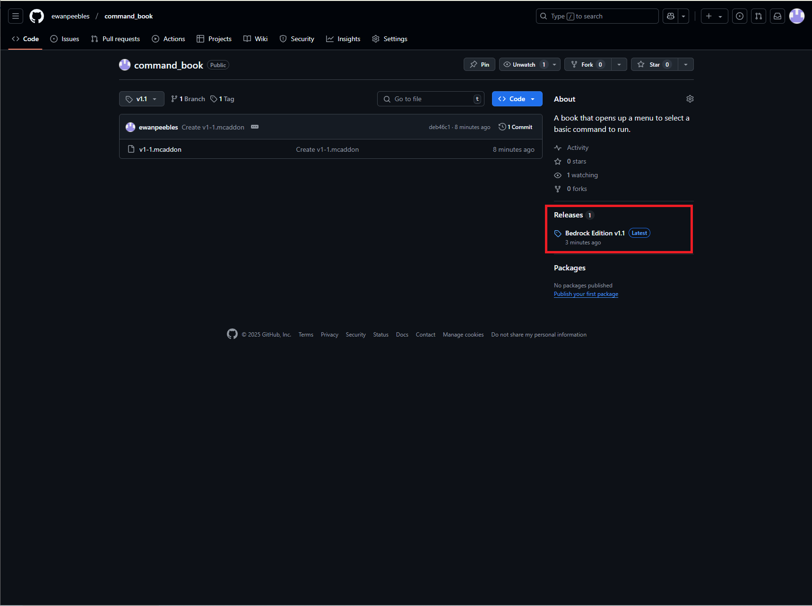

# Command book
This is a mod to aid creators or anybody else who find themselves having to turn on cheats and do complicated stuff to run commands.

Important: this mod only works on Minecraft: Bedrock edition and is designed for Windows 10. It may not work on other operating systems.This mod is not compatible with Java edition.

# Instructions:
(Note: if you already have installed a version of this mod, then [follow these instructions](#updating-instructions))
1. Find the releases section of the repository under the "About" section.

2. Select the latest release.
3. Click on the .mcaddon file under "Assets".
4. Open the folder where the file was downloaded. If Minecraft is installed, the icon for the file should be a grass block.
5. Open it (by double left-clicking it).
6. Minecraft should automatically open it and import it. You can now use this mod by activating it under the behavior pack section in your world.

# Updating instructions:
1. Open file explorer.
2. Go to C:\ on your computer (or wherever your account.)
3. Go to Users, then your username. (This is not Default or Public.)
4. Go to the directory bar and paste the following at the end: \AppData\Local\Packages\Microsoft.MinecraftUWP_8wekyb3d8bbwe\LocalState\games\com.mojang
5. This is where all the mods are stored for Minecraft. Go to the behavior_packs folder. 
6. find the folder "CommandBoo". To make sure it is the right pack, open the manifest.json (the pack definer) with any text editor, like Notepad. In the metadata section, the author should be "Steak".
7. Delete the folder that the correct mod is in (the CommandBoo folder, or the one you found.)
8. Repeat steps 6-7 for the resource_packs folder in the com.mojang folder.
9. [Import the mod!](#instructions)